# Iris

<picture>
  <source media="(prefers-color-scheme: dark)" srcset="docs/assets/hero-dark.svg">
  <source media="(prefers-color-scheme: light)" srcset="docs/assets/hero-light.svg">
  
</picture>

A fast coding agent for the terminal, built for token efficiency.

---

## Install

Prebuilt binaries ship for Linux and macOS (x86_64 and aarch64) — no Rust
toolchain required. The installer downloads the latest release, verifies its
SHA-256 checksum, and installs `iris`:

```bash
curl -fsSL https://raw.githubusercontent.com/5omeOtherGuy/iris-agent/main/install.sh | sh
```

Override the install directory with `IRIS_INSTALL_DIR` or pin a version with
`IRIS_VERSION=vX.Y.Z`. Manual installs use the same archive plus checksum from
the [latest release](https://github.com/5omeOtherGuy/iris-agent/releases/latest).

With a Rust toolchain, install from [crates.io](https://crates.io/crates/iris-agent)
instead:

```bash
cargo install iris-agent --locked
```

Keep an installed copy current with:

```bash
iris update
```

A prebuilt binary downloads the latest release, verifies its checksum, and
atomically replaces itself; a source build re-runs `cargo install` pinned to
the latest release tag. Either way `iris update` installs only stable tagged
releases — never `main`, never a prerelease — and never downgrades.

**Runtime dependencies: none beyond the binary.** The `grep` and `find` tools
search in-process via the ripgrep library crates (`grep`, `ignore`, `globset`),
so no `rg` or `fd` binary needs to be on `PATH`.

## Documentation

OpenWiki-generated agent docs live in `openwiki/` and are prepared with
[docs/OPENWIKI.md](docs/OPENWIKI.md). The docs website is intentionally kept in a
separate repository so the Rust CLI release path does not depend on a frontend
stack.

## Platforms

| Platform | Status | `bash` sandbox |
| --- | --- | --- |
| Linux | Supported | Kernel-enforced (Landlock LSM), opt-in via `IRIS_SECURITY_OPT_IN=1` |
| macOS | Supported | None yet — the shell runs **unconfined** |
| Windows | Unsupported | — |

macOS caveat: the `bash` sandbox is Linux-only. On macOS every shell command
runs without kernel confinement. Iris still asks before running mutating tools,
and when a `bash` approval prompt is shown on macOS, it states `unsandboxed` at
the point you approve a command, so the posture is visible where you decide, not
buried in a startup line. `IRIS_SECURITY_OPT_IN=1` controls workspace path and
Landlock enforcement, not whether mutating tools require approval. macOS
Seatbelt confinement is a planned follow-up ([docs/ROADMAP.md](docs/ROADMAP.md));
until it lands, treat macOS shell commands as unsandboxed.

## Run

Create credentials for the provider you want, then start the REPL:

```bash
iris login openai-codex   # or: anthropic · antigravity
iris                      # /exit or /quit to leave
```

From a source checkout, replace `iris` with `cargo run --`.

### Headless print mode

Run one turn without the REPL and print just the final answer to stdout:

```bash
iris -p "summarize the build failure"          # --print is the long form
cat build.log | iris -p "explain this failure"  # piped stdin merges into the prompt
iris --print "apply the fix" --approve          # auto-approve gated tools
```

Print mode is non-interactive: it exits 0 on success and nonzero on failure, and
never prompts. Mutating tools (`bash`, `edit`, `write`) are denied by default;
pass `--approve` to auto-approve them. When stdin is piped it is appended to the
prompt after a blank line; on a TTY there is nothing to merge. Only the final
assistant answer reaches stdout.

### Terminal multiplexers (tmux)

Iris renders inline -- no alternate screen, no mouse capture -- so the terminal
keeps owning what a multiplexer user expects it to own: the transcript flows
into native scrollback, wheel scroll / copy-mode / text selection work
unmodified, and detach/reattach just works. Narrow panes are fine; the layout
wraps to any width.

Resize behavior: until the transcript has scrolled past the pane, resizes never
touch the pane's scrollback, so whatever was there before Iris started (shell
history, for example) survives every split and drag. Once the transcript has
scrolled, a resize rebuilds the pane's scrollback from Iris state so history
rewraps to the new width.

Optional tmux settings that improve the experience:

```tmux
set -g focus-events on   # pause the working animation in unfocused panes
```

tmux >= 3.4 additionally passes synchronized-output through, making mid-turn
updates flicker-free, and `extended-keys` enables the enhanced keyboard
protocol Iris negotiates where available.

### Resuming sessions

```bash
iris -c                    # or --continue: resume the newest session for this directory
iris resume                # pick a session to resume (picker on a TTY; list otherwise)
iris resume <session-id>   # resume a specific session by id
```

`iris -c`/`--continue` reopens the most recent session for the current
directory; it errors clearly when the directory has no prior session. `iris
resume` with no id opens a `/resume` picker on a rich TTY, or prints the
directory's sessions (id, age, first-message preview) and exits on a plain/piped
front-end. Mid-session, `/resume` opens the same picker and `/new` starts a
fresh session — both swap the live session at a safe turn boundary without
restarting the process.

At the prompt, `/model` views or switches provider/model and
`/reasoning off|minimal|low|medium|high|xhigh` changes thinking effort at a safe
turn boundary. In the rich TUI, `$` or `/skills` opens the installed-skill
picker. `/resume`, `/new`, `/settings`,
`/scoped-models`, `/trust` (or `/permissions`), `/login`, and `/logout` open
selectors or actions; in the text fallback those selector commands report that
they are TUI-only. `/session` shows the
current session's file, id, message counts, and context-token estimate;
`/copy` puts the last assistant reply on the system clipboard (OSC 52 fallback
over SSH); `/debug` writes a debug snapshot of the rendered screen and the
conversation context to `~/.iris/iris-debug.log`.

<details>
<summary><b>Providers, settings &amp; environment</b></summary>

### Credentials and provider selection

Iris stores OAuth credentials in an Iris auth file. By default it reads
`~/.iris/auth.json`. Create or refresh credentials:

```bash
iris login openai-codex
iris login openai-codex --device-code
iris login anthropic
ANTIGRAVITY_CLIENT_SECRET=... iris login antigravity
```

- `openai-codex` uses OpenAI Codex OAuth (browser or device-code) and is the
  default provider if no setting is present.
- `anthropic` uses the Claude Code OAuth lane. `iris login anthropic` runs a
  browser PKCE login with a manual paste fallback; Iris can also bootstrap from
  Claude Code's token at `~/.claude/.credentials.json` (or
  `CLAUDE_CONFIG_DIR/.credentials.json`) when Anthropic credentials are not
  already in the Iris auth store.
- `antigravity` uses Google OAuth for Gemini Code Assist. Its installed-app
  client ID is public and decoded at runtime; the client secret is not committed
  to source and must be supplied via `ANTIGRAVITY_CLIENT_SECRET` at runtime or
  when building Iris.

Override the auth-file path with `IRIS_AUTH_PATH=/path/to/auth.json iris`.

### Settings

Choose the provider for a run with `defaultProvider` in the global JSON settings
file (`~/.iris/settings.json`, or `IRIS_CONFIG_PATH`):

```json
{
  "defaultProvider": "antigravity",
  "defaultModel": "gemini-3.5-flash"
}
```

Supported provider ids are `openai-codex`, `anthropic`, and `antigravity`.
Recognized settings keys are `defaultProvider`, `defaultModel`, `baseUrl`,
`contextTokenBudget`, `defaultReasoning`, `promptCacheRetention`,
`anthropicContextManagement`, `compaction`, `toolResultCompaction`, and
`enabledModels`.

If unset, `promptCacheRetention` defaults to `short`; set it to `none` to omit
provider-native prompt-cache hints.

Automatic compaction uses the selected model's effective context window. An
explicit `contextTokenBudget` remains an absolute upper bound. Provider-native
compaction and active-provider summaries are the defaults; unsupported native
routes fall back through the portable summarizer. Microcompaction and
tool-result compaction remain disabled unless enabled explicitly. Tune or
disable the trigger ladder with:

```json
{
  "compaction": {
    "enabled": true,
    "thresholds": { "warn": 0.60, "start": 0.72, "hard": 0.90 },
    "keepRecentTokens": 8000,
    "hardWaitMs": 10000,
    "maxConsecutiveFailures": 3
  }
}
```

`compaction.enabled=false` disables automatic rewrites; manual `/compact` and
tool-result folds keep their own behavior. A legacy budget below 8,192 tokens is
invalid because it cannot reserve space for a summary.

Tool-result compaction is opt-in. This example enables stale-read dedupe and
older replayable-result clearing locally:

```json
{
  "toolResultCompaction": {
    "enabled": true,
    "aggressiveness": "custom",
    "cacheTiming": "cacheAware",
    "triggerTokens": 64000,
    "semanticDedupe": {
      "enabled": true,
      "retainPerPath": 1,
      "protectRecentToolResults": 4,
      "protectRecentTokens": 2000
    },
    "toolClearing": {
      "enabled": true,
      "backend": "local",
      "mode": "replayable",
      "keepRecentToolUses": 8,
      "clearAtLeastTokens": 1000,
      "eligibleTools": [],
      "excludedTools": ["edit", "write", "recall", "read_output"],
      "includeFailures": false,
      "clearToolInputs": false
    }
  }
}
```

`aggressiveness` accepts `conservative`, `balanced`, `aggressive`, or `custom`.
`cacheTiming` accepts `breakOnly`, `cacheAware`, `pressureOnly`, or `immediate`.
`backend` accepts `local`, `anthropicNative`, or `auto`. Anthropic-native
clearing is global-only and must be disjoint from local reducers. The legacy
`microcompaction=true` setting remains a conservative alias with the independent
`microcompactionWatermark` default of 64,000 tokens. Folded originals remain in
the local session transcript and can be retrieved with
`recall(tool_call_id="...")`.

Project settings (`<cwd>/.iris/settings.json`) are deliberately limited to
local model/runtime preferences, including local tool-result reducers and cache
timing. A cloned repo cannot choose your provider, scoped model cycle,
provider-side cache retention, Anthropic server-side context-management
behavior, select a native compaction backend, or redirect OAuth bearer tokens
with `baseUrl`.

### Project permissions (`/trust`)

The fragment portion of the system prompt is assembled entirely from fragments
built into the binary. No `.md` fragment files are read from
`~/.iris/fragments` or a repo's `.iris/fragments`, so a cloned repo cannot
inject through the old fragment surface (ADR-0026). Project docs
(`AGENTS.md`/`CLAUDE.md`) remain the intentional repo/user steering channel;
review them like any other project instruction file.

### Skills

Iris loads Codex-compatible filesystem skills. A skill is a directory containing
`SKILL.md` with YAML `name` and `description` fields:

```markdown
---
name: review-patch
description: Review a patch for correctness, safety, and missing tests.
---

Follow the review workflow here.
```

Discovery matches Codex's local layout:

- `.agents/skills` in each directory from the repository root to the current
  working directory;
- `<repo>/.codex/skills` for Codex's legacy project location;
- `~/.agents/skills` for user skills;
- `$CODEX_HOME/skills` (default `~/.codex/skills`) and its bundled `.system`
  root for existing Codex installs;
- `~/.iris/skills` for Iris-only installs;
- `/etc/codex/skills` and `/etc/iris/skills` for administrator-installed skills.

Type `$` or run `/skills` to search and insert a path-qualified mention. A
unique `$skill-name` works directly. Iris also advertises skill names,
descriptions, and paths to the model so it can select a matching skill
implicitly. Only metadata enters the initial context, capped at 2% of the
configured context budget; the full `SKILL.md` loads when selected. Set
`policy.allow_implicit_invocation: false` in `agents/openai.yaml` to require an
explicit mention. Skill edits are detected at the next turn boundary.
Optional `metadata.short-description`, `interface`, `dependencies`, and
`policy` fields use Codex's `agents/openai.yaml` schema. Iris honors
`skills.include_instructions` and ordered `skills.config` enable/disable rules
from `$CODEX_HOME/config.toml`. A selected global skill may read references
beneath its own directory even when workspace confinement is enabled; no skill
root grants write access outside the workspace.

Per-project permissions persist in `~/.iris/trust.json`, keyed by the canonical
(symlink-resolved) working directory (ADR-0027):

- At an approval prompt, `[p]` ("always for this project") persists a grant:
  the tool name for `write`/`edit`, the exact command for `bash`. Granted
  tools/commands auto-approve in this directory from then on, across sessions.
- Destructive commands (`rm`, `dd`, `mkfs`, ...) always re-prompt and can never
  be granted — no `[p]` is offered for them.
- `/trust` (alias: `/permissions`) opens the rich-TUI project-permissions
  editor: toggle `write`/`edit` grants and revoke stored `bash` command/prefix
  grants. The text fallback has no editor, but its approval prompt still
  supports `[p]` grants.
- The store is HOME-owned; a repo-committed file can never grant permissions.
  `IRIS_TRUST_PATH` may override the store only with an absolute path outside
  the project directory.

### Environment variables

- `IRIS_AUTH_PATH` — auth-file path; defaults to `~/.iris/auth.json`.
- `IRIS_MODEL` — OpenAI Codex model override; defaults to `gpt-5.5`.
- `IRIS_CODEX_BASE_URL` — OpenAI Codex base URL; defaults to `https://chatgpt.com/backend-api`.
- `IRIS_CONFIG_PATH` — global settings-file path; defaults to `~/.iris/settings.json`.
- `IRIS_TRUST_PATH` — project-permission policy store path; defaults to `~/.iris/trust.json`; overrides must be absolute and outside the project directory.
- `IRIS_SESSION_DIR` — session transcript root; defaults to `~/.iris/sessions`.
- `CODEX_HOME` — optional existing Codex home; Iris reads its `skills`
  directory and skill settings in `config.toml` for compatibility.
- `CLAUDE_CONFIG_DIR` — Claude Code config directory override for Anthropic token bootstrap.
- `ANTIGRAVITY_CLIENT_SECRET` — Antigravity Google OAuth client secret, read at runtime or embedded when set while building Iris; required for `login antigravity` and refresh unless the binary was built with it.
- `ANTIGRAVITY_PROJECT_ID` — optional Antigravity project-id override; when set it wins over any persisted project id, otherwise Iris discovers/persists one from `loadCodeAssist` and errors if discovery fails.

</details>

## Status

As of 2026-07-03: Milestone 1, the async-hard runtime, and the Milestone 2
foundations are complete. The active gate is the first Git-Centered Workflow
slice — dirty-tree safety, task checkpoint/rollback, final diff summary, and
the verification loop (epic
[#261](https://github.com/5omeOtherGuy/iris-agent/issues/261), design accepted
in ADR-0028). Per-result output reduction is measured (see
[Token efficiency](#token-efficiency)). The end-to-end tokens-per-task benchmark
([#210](https://github.com/5omeOtherGuy/iris-agent/issues/210)) has a committed
plan, replay harness, and report; deterministic replay shows the default arm
spending fewer prompt tokens than a reductions-off baseline with equal success,
but the real-provider confirmation that closes the Milestone-2 gate is still
pending.

Implemented:

- Interactive terminal TUI, with a plain-text fallback for pipes and CI.
- Tokio async runtime with turn-level cancellation.
- Multiple providers (OpenAI Codex, Anthropic, Antigravity) with runtime model/reasoning switching.
- Workspace-scoped tools: read, write, edit, bash, grep, find, ls.
- Opt-in `read` skim mode: language-aware stripping of comments, docstrings,
  and blank lines for exploration reads (50-72% token reduction on
  comment-heavy source, asserted as minimum bars; data formats pass through
  byte-identical; a skim read does not satisfy read-before-edit). See the
  [read skim benchmark](docs/benchmarks/issue-337-read-skim-tokens.md).
- Approval gates with diff previews for mutating tools.
- JSONL transcript persistence and linear resume (`iris --continue`, `iris
  resume`, in-session `/resume` picker and `/new`).
- Large-output handles and turn-boundary auto-compaction.
- Native bash output filtering: command output is reduced inside the runtime
  before it enters the transcript (measured; see
  [Token efficiency](#token-efficiency)).
- Codex-compatible native skills with repo/user/system/admin discovery, progressive
  disclosure, explicit and implicit invocation, and a searchable TUI picker.

Next:

- Git-centered workflow slice: dirty-tree safety, checkpoint/rollback, final
  diff summary, verification loop (epic #261, ADR-0028).
- Token-efficiency benchmark: real-provider tokens-per-task confirmation (#210;
  plan, replay harness, and report already landed).
- Persistent approval policies, modes, and subagents.

## Token efficiency

Every tool result carries the fewest tokens that preserve full task success
([ADR-0036](docs/adr/0036-tools-are-token-efficient-by-design.md)). Native
tools return bounded windows, oversized results move behind session handles,
and `bash` filters captured command output inside the runtime before it
reaches the transcript
([ADR-0037](docs/adr/0037-native-output-filtering-for-bash-pass-through.md)):
structured Rust filters for the highest-volume command classes, declarative
filters for roughly 60 more commands.

Measured on a committed corpus of captured real command outputs; the numbers
are asserted as minimum bars by tests, not just reported:

| command class | token reduction |
|---|---|
| cargo build (pass) | 98% |
| cargo test (pass) | 85–94% |
| npm install | 79% |
| npm test / vitest (pass) | 68% / 70% |
| git log | 62% |
| git diff (lockfile churn) | 58% |
| git status | 50% |

Reduction never changes semantics:

- Failure detail is exempt: failing-test names, panic messages, `file:line`
  references, compiler diagnostics, and source diff hunks survive verbatim
  (test-asserted per fixture).
- Any filter error or unparsable output returns the raw output; exit codes
  are never altered.
- `raw: true` on a bash call bypasses filtering; full output stays reachable
  via session handles.
- Filter overhead is under 10 ms per call (asserted).

Full table, bars, and the regeneration command:
[bash filter benchmark](docs/benchmarks/adr-0037-bash-filter-tokens.md).

End-to-end, does a *completed task* cost fewer tokens with reductions on? The
[tokens-per-task benchmark](docs/benchmarks/tokens-per-task.md)
([plan](docs/BENCHMARK_PLAN.md), issue #210) measures this. Deterministic replay
of three workloads (fix-a-failing-test, multi-file rename, large-log triage)
shows the default arm spending fewer prompt tokens than a reductions-off baseline
(3.4-9.1% on the current fixtures) with identical success and zero approval
prompts, and asserts the reduced output still carries every task-critical fact
verbatim. Replay proves the plumbing, not that a model still completes the task
from reduced context: the real-provider confirmation (>= 3 real runs per cell)
is pending, so this Milestone-2 gate stays open ([roadmap](docs/ROADMAP.md)) and
no headline efficiency number is claimed yet.

## Testing

```bash
cargo test
```

## Documentation

- [Naming convention](docs/NAMING.md) — how the Iris/Wayland/Nexus/Mimir tiers are named.
- [Roadmap](docs/ROADMAP.md) — milestone sequencing and acceptance gates.
- [Releasing](docs/RELEASING.md) — operator runbook for cutting a public release.
- [Feature list](docs/FEATURES.md) — implemented/planned capability inventory.
- [Product brief](PRODUCT.md) — target users, product purpose, voice, and product principles.
- [Design system summary](DESIGN.md) — concise visual-system summary for the Iris TUI.
- [Current codemap](docs/CODEMAPS/INDEX.md) — source-grounded map of the current codebase.
- [TUI design language](docs/TUI_DESIGN_LANGUAGE.md) — terminal layout, spacing, and menu rules.
- [TUI live testing](docs/TUI_LIVE_TESTING.md) — opt-in tmux harness for manual pane-rendering checks.
- [Architecture Decision Records](docs/adr/README.md) — accepted/proposed architecture decisions.
- [Competitor matrix](docs/COMPETITOR_MATRIX.md) — verified competitor feature matrix.
- [Competitor analysis](docs/COMPETITOR_ANALYSIS.md) — strategic competitor notes.

## License

[MIT](LICENSE).
